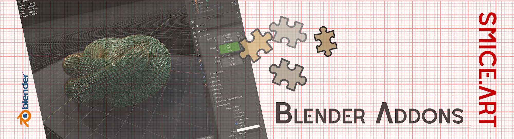
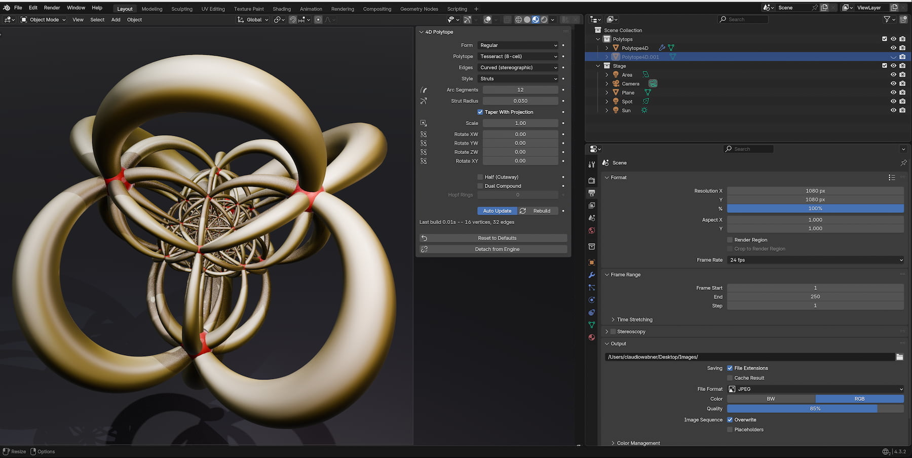

  

# 4D Polytope Engine
A Blender addon to generate in Blender 4D Polytope. 

# Screen Shot
Click here [PREVIEW](previews/gallery.md) to see a selection of 100 previews of most possible combination you can generate with the Tool.

## The Idea
The idea behind this add-on was to make it possible, beside "jenn3D" or other great online tools, to create polytope inside blender.

## Installation
Note: Please download the file located under the Assets section of the latest Releases page, rather than the "Download ZIP" button on the main page.

1. Download the latest release from the [Releases page](https://github.com/smice-art/Blender-4D-Polytope-Engine/releases/tag/4dpolytope).
2. In Blender, go to **Edit > Preferences > Get Extensions**.
3. Click the dropdown in the top right and select **Install from Disk**.
4. Select your `.zip` file.

## Documentation
The Add-on is easy to understand. All adjustment are placed in a N-Panel Slider "4d Polytope". There is a detailed manual in the section DOCS: [MANUAL](docs/manual.md)

## Release Notes

## v2.0.0 (July 20, 2026)
- **Publishing**: First public upload of the Add-on.

## License
GPL‑3.0‑or‑later

## Blender

